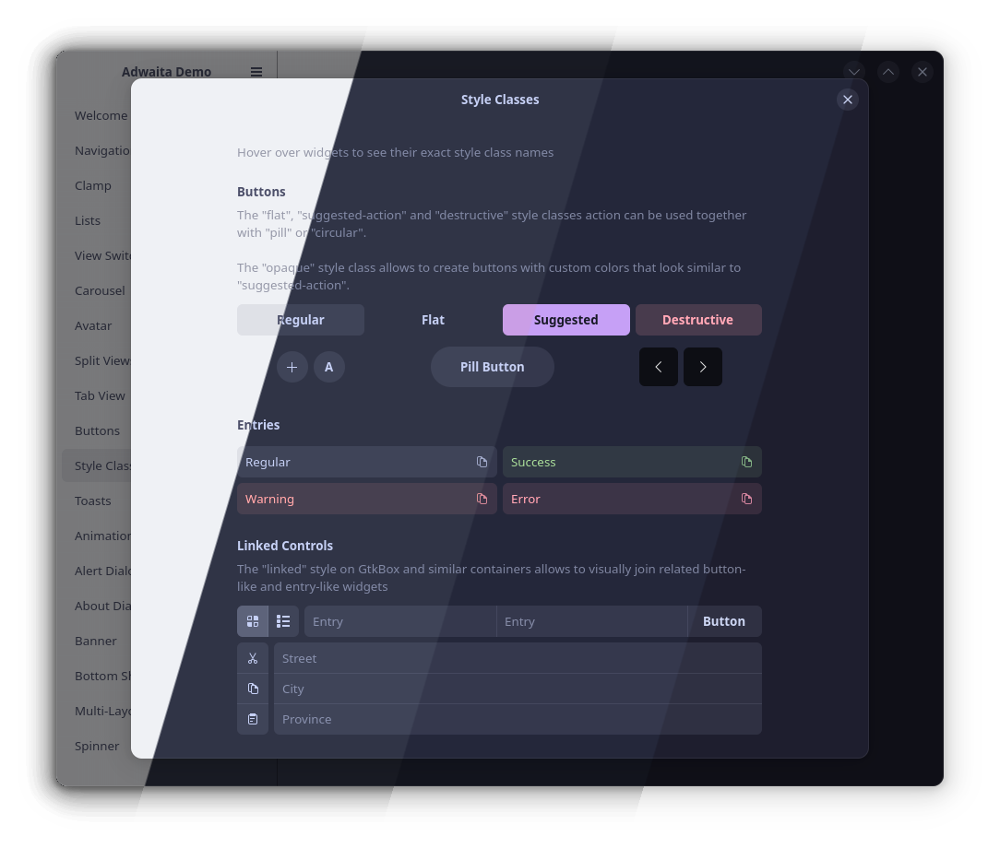
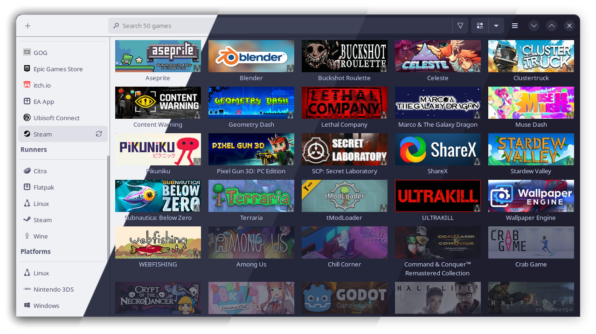

# adw-catppuccin
 A unofficial Catppuccin port for [Adwaita](https://gnome.pages.gitlab.gnome.org/libadwaita), based on [adw-colors](https://github.com/lassekongo83/adw-colors). Compatible with both libadwaita apps and the [adw-gtk3](https://github.com/lassekongo83/adw-gtk3) theme.

| Libadwaita | adw-gtk3 |
|:----------:| :-------:|
|  |  |

 # Installation

 Copy the `gtk.css` file in  `~/.config/gtk-4.0/gtk.css` and `~/.config/gtk-3.0/gtk.css`.
 >If you already have files in these directories, just put them in a subdirectories as backup.

For flatpak apps, allows access to these directories by running:
```
sudo flatpak override --filesystem=xdg-config/gtk-3.0 && sudo flatpak override --filesystem=xdg-config/gtk-4.0
```
>You might need to log out/reboot you're computer for it to take effect.

## For more information, check out the [adw-colors](https://github.com/lassekongo83/adw-colors) repo (thanks to it that I could make these go check them out <3 ).
